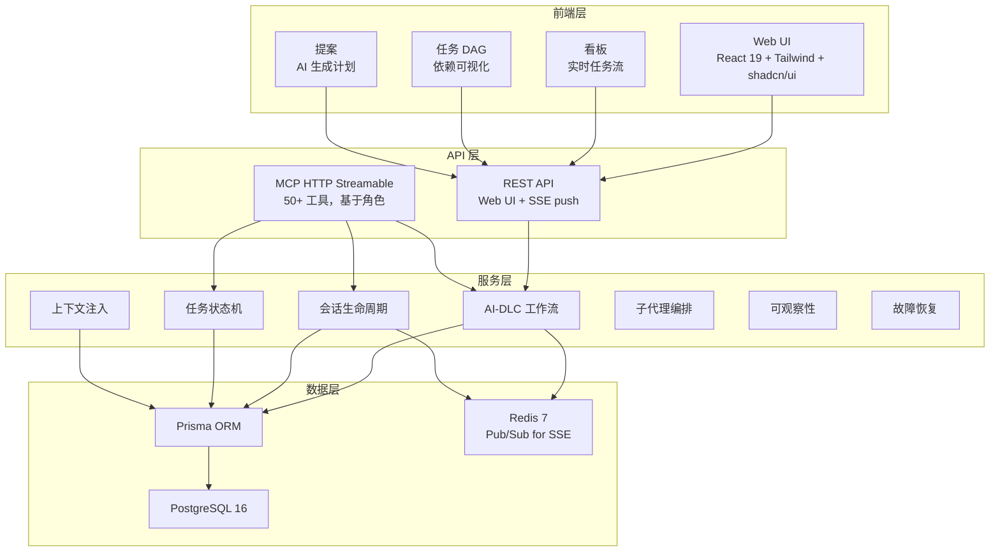

# Chorus - Agent Harness for AI-Human Collaboration

## 1. 项目概览

Chorus 是一个代理 harness（代理管理框架），用于管理 LLM 代理的会话生命周期、任务状态、子代理编排、可观察性和故障恢复。它允许多个 AI 代理（PM、开发者、管理员）和人类通过从需求到交付的完整工作流程进行协作。

### 核心价值
- **AI-DLC 工作流**：基于 AI-Driven Development Lifecycle 方法论，实现 Idea → Proposal → Execute → Verify 的完整流程
- **会话管理**：持久会话、心跳检测、自动过期和故障恢复
- **任务 DAG**：依赖建模、循环检测和交互式可视化
- **看板**：实时任务流，带有 Worker 徽章和代理状态指示
- **多代理协作**：支持 Claude Code Agent Teams（Swarm 模式）并行执行
- **实时状态**：代理存在指示器和跨列看板动画

### 应用场景
- 软件开发项目管理
- AI 代理团队协作
- 需求到交付的完整工作流管理
- 任务依赖关系管理和可视化

## 2. 目录结构

Chorus 采用模块化架构，清晰分离前端、后端和配置文件。项目使用 Next.js 15 App Router 结构，将 API 路由和页面路由分离管理。

```text
├── docs/             # 项目文档
├── messages/         # 国际化消息文件
├── packages/         # 可重用包
│   ├── chorus-cdk/   # AWS CDK 部署配置
│   ├── landing/      # 着陆页
│   └── openclaw-plugin/ # OpenClaw 插件
├── prisma/           # Prisma ORM 配置和迁移
├── public/           # 静态资源
├── scripts/          # 脚本文件
└── src/              # 源代码
    ├── app/          # Next.js 应用
    ├── components/   # React 组件
    ├── contexts/     # React 上下文
    ├── hooks/        # React 钩子
    ├── i18n/         # 国际化
    ├── lib/          # 核心库
    ├── mcp/          # MCP 服务器和工具
    ├── services/     # 业务逻辑服务
    └── types/        # TypeScript 类型
```

### 主要目录详解

| 目录 | 职责 | 关键文件 |
|------|------|----------|
| src/app | Next.js 应用路由和 API | [src/app/api](file:///workspace/src/app/api) |
| src/services | 业务逻辑服务 | [src/services](file:///workspace/src/services) |
| src/lib | 核心工具库 | [src/lib](file:///workspace/src/lib) |
| src/components | UI 组件 | [src/components](file:///workspace/src/components) |
| src/mcp | MCP 服务器和工具 | [src/mcp](file:///workspace/src/mcp) |
| prisma | 数据库配置和迁移 | [prisma/schema.prisma](file:///workspace/prisma/schema.prisma) |

## 3. 系统架构

Chorus 采用分层架构，从前端到后端清晰分离，支持 AI 代理和人类用户的协作。

### 架构图



### 核心架构组件

1. **前端层**：使用 React 19、Tailwind CSS 4 和 shadcn/ui 构建，提供看板、任务 DAG、提案等界面。

2. **API 层**：
   - REST API：为 Web UI 提供数据和 SSE 推送
   - MCP API：为 AI 代理提供 50+ 工具，支持基于角色的访问控制

3. **服务层**：实现 AI-DLC 工作流、会话生命周期管理、任务状态机、子代理编排等核心功能。

4. **数据层**：
   - PostgreSQL 16：存储核心数据
   - Redis 7：用于 Pub/Sub 和 SSE 推送
   - Prisma ORM：数据库访问层

## 4. 核心模块

### 4.1 任务管理模块

任务管理模块负责任务的创建、更新、状态管理和依赖关系处理。

#### 主要功能
- 任务生命周期管理（创建、更新、删除）
- 任务状态转换（open → assigned → in_progress → to_verify → done → closed）
- 任务依赖关系管理（DAG 构建和循环检测）
- 验收标准管理（开发者自检和管理员验证）

#### 核心函数

| 函数名 | 描述 | 位置 |
|--------|------|------|
| `listTasks` | 列出任务，支持分页和过滤 | [task.service.ts](file:///workspace/src/services/task.service.ts#L399) |
| `getTask` | 获取任务详情 | [task.service.ts](file:///workspace/src/services/task.service.ts#L457) |
| `createTask` | 创建任务 | [task.service.ts](file:///workspace/src/services/task.service.ts#L486) |
| `updateTask` | 更新任务 | [task.service.ts](file:///workspace/src/services/task.service.ts#L525) |
| `claimTask` | 认领任务 | [task.service.ts](file:///workspace/src/services/task.service.ts#L591) |
| `releaseTask` | 释放任务 | [task.service.ts](file:///workspace/src/services/task.service.ts#L625) |
| `addTaskDependency` | 添加任务依赖 | [task.service.ts](file:///workspace/src/services/task.service.ts#L1013) |
| `removeTaskDependency` | 移除任务依赖 | [task.service.ts](file:///workspace/src/services/task.service.ts#L1051) |
| `checkDependenciesResolved` | 检查依赖是否解决 | [task.service.ts](file:///workspace/src/services/task.service.ts#L1165) |

### 4.2 提案管理模块

提案管理模块负责从想法到提案的转换，包括文档草稿和任务草稿的管理。

#### 主要功能
- 提案创建和更新
- 文档草稿管理
- 任务草稿管理
- 提案验证和审批流程
- 提案到实际任务和文档的转换

#### 核心函数

| 函数名 | 描述 | 位置 |
|--------|------|------|
| `createProposal` | 创建提案 | [proposal.service.ts](file:///workspace/src/services/proposal.service.ts#L526) |
| `updateProposalContent` | 更新提案内容 | [proposal.service.ts](file:///workspace/src/services/proposal.service.ts#L572) |
| `validateProposal` | 验证提案完整性 | [proposal.service.ts](file:///workspace/src/services/proposal.service.ts#L174) |
| `approveProposal` | 审批提案 | [proposal.service.ts](file:///workspace/src/services/proposal.service.ts#L619) |
| `rejectProposal` | 拒绝提案 | [proposal.service.ts](file:///workspace/src/services/proposal.service.ts#L773) |
| `submitProposal` | 提交提案审核 | [proposal.service.ts](file:///workspace/src/services/proposal.service.ts#L841) |
| `addDocumentDraft` | 添加文档草稿 | [proposal.service.ts](file:///workspace/src/services/proposal.service.ts#L882) |
| `addTaskDraft` | 添加任务草稿 | [proposal.service.ts](file:///workspace/src/services/proposal.service.ts#L914) |

### 4.3 会话管理模块

会话管理模块负责 AI 代理会话的生命周期管理，包括创建、心跳、过期和故障恢复。

### 4.4 通知模块

通知模块负责系统通知的管理，包括实时推送和用户偏好设置。

### 4.5 搜索模块

搜索模块提供跨实体类型的全局搜索功能，支持键盘快捷键（Cmd+K）。

## 5. 关键 API

### 5.1 REST API

| 端点 | 方法 | 功能 | 位置 |
|------|------|------|------|
| `/api/projects/{uuid}` | GET | 获取项目详情 | [src/app/api/projects/[uuid]/route.ts](file:///workspace/src/app/api/projects/[uuid]/route.ts) |
| `/api/tasks` | GET | 列出任务 | [src/app/api/tasks/[uuid]/route.ts](file:///workspace/src/app/api/tasks/[uuid]/route.ts) |
| `/api/tasks` | POST | 创建任务 | [src/app/api/tasks/[uuid]/route.ts](file:///workspace/src/app/api/tasks/[uuid]/route.ts) |
| `/api/proposals` | GET | 列出提案 | [src/app/api/proposals/[uuid]/route.ts](file:///workspace/src/app/api/proposals/[uuid]/route.ts) |
| `/api/proposals` | POST | 创建提案 | [src/app/api/proposals/[uuid]/route.ts](file:///workspace/src/app/api/proposals/[uuid]/route.ts) |
| `/api/proposals/{uuid}/approve` | POST | 审批提案 | [src/app/api/proposals/[uuid]/approve/route.ts](file:///workspace/src/app/api/proposals/[uuid]/approve/route.ts) |
| `/api/search` | GET | 全局搜索 | [src/app/api/search/route.ts](file:///workspace/src/app/api/search/route.ts) |

### 5.2 MCP API

MCP (Model Context Protocol) API 为 AI 代理提供工具访问，支持基于角色的权限控制。

#### 主要工具类别
- **public**：公共工具
- **pm**：产品经理工具
- **developer**：开发者工具
- **admin**：管理员工具
- **session**：会话管理工具
- **presence**：状态指示工具

## 6. 技术栈

| 组件 | 技术 | 版本 | 用途 |
|------|------|------|------|
| 框架 | Next.js | 15 | 全栈应用框架 |
| 语言 | TypeScript | 5 | 类型安全的 JavaScript |
| 前端 | React | 19 | 用户界面库 |
| 样式 | Tailwind CSS | 4 | 实用优先的 CSS 框架 |
| UI 组件 | shadcn/ui | - | 基于 Radix UI 的组件库 |
| ORM | Prisma | 7 | 数据库访问层 |
| 数据库 | PostgreSQL | 16 | 关系型数据库 |
| 缓存/消息 | Redis | 7 | Pub/Sub 和缓存 |
| 代理集成 | MCP SDK | 1.26 | AI 代理通信协议 |
| 认证 | OIDC + PKCE | - | 身份验证 |
| 国际化 | next-intl | - | 多语言支持 |
| 部署 | Docker | - | 容器化部署 |

## 7. 部署与运行

### 7.1 本地开发

#### 方法 1：使用嵌入式 PGlite（最简单）

```bash
npm install -g @chorus-aidlc/chorus
chorus
```

默认访问地址：http://localhost:8637
默认登录凭据：admin@chorus.local / chorus

#### 方法 2：使用 Docker Compose（推荐）

```bash
git clone https://github.com/Chorus-AIDLC/chorus.git
cd chorus

DEFAULT_USER=admin@example.com DEFAULT_PASSWORD=changeme \
  docker compose -f docker-compose.local.yml up -d
```

#### 方法 3：完整开发环境

```bash
cp .env.example .env
pnpm docker:db
pnpm install
pnpm db:migrate:dev
pnpm dev
# 访问 http://localhost:8637
```

### 7.2 生产部署

#### Docker Compose（完整堆栈）

```bash
DEFAULT_USER=admin@example.com DEFAULT_PASSWORD=changeme \
  docker compose up -d
```

#### AWS 部署

```bash
./install.sh
```

交互式安装程序会配置 VPC、Aurora Serverless v2、ElastiCache Serverless、ECS Fargate 和 ALB。

### 7.3 环境变量

| 变量 | 描述 | 默认值 |
|------|------|--------|
| `DATABASE_URL` | 数据库连接字符串 | - |
| `REDIS_URL` | Redis 连接字符串 | - |
| `NEXTAUTH_SECRET` | NextAuth 密钥 | chorus-docker-secret-change-in-production |
| `COOKIE_SECURE` | Cookie 安全标志 | false |
| `DEFAULT_USER` | 默认管理员用户名 | - |
| `DEFAULT_PASSWORD` | 默认管理员密码 | - |

## 8. 开发指南

### 8.1 项目设置

1. 克隆仓库
2. 安装依赖：`pnpm install`
3. 配置环境变量：`cp .env.example .env`
4. 启动数据库：`pnpm docker:db`
5. 运行迁移：`pnpm db:migrate:dev`
6. 启动开发服务器：`pnpm dev`

### 8.2 测试

```bash
# 运行测试
pnpm test

# 运行测试并生成覆盖率报告
pnpm test:coverage

# 监视模式运行测试
pnpm test:watch
```

### 8.3 代码风格

- 使用 TypeScript 严格模式
- 遵循 ESLint 规则
- 使用 Prettier 格式化代码

### 8.4 提交规范

- 遵循 Conventional Commits 规范
- 提交前运行 `pnpm lint` 确保代码质量

## 9. 监控与维护

### 9.1 日志

Chorus 使用 Pino 进行结构化日志记录，支持不同级别的日志输出。

### 9.2 健康检查

API 提供健康检查端点：`/api/health`

### 9.3 常见问题

| 问题 | 解决方案 |
|------|----------|
| 数据库连接失败 | 检查 `DATABASE_URL` 环境变量 |
| Redis 连接失败 | 检查 `REDIS_URL` 环境变量 |
| 代理无法连接 | 检查 API 密钥和 MCP 配置 |
| 任务依赖循环 | 检查任务依赖关系，避免循环依赖 |

## 10. 扩展与集成

### 10.1 OpenClaw 插件

Chorus 提供 OpenClaw 插件，用于连接 OpenClaw 与 Chorus。

位置：[packages/openclaw-plugin](file:///workspace/packages/openclaw-plugin)

### 10.2 AWS CDK 部署

提供 AWS CDK 配置，用于在 AWS 上部署 Chorus。

位置：[packages/chorus-cdk](file:///workspace/packages/chorus-cdk)

### 10.3 自定义技能

Chorus 支持自定义技能扩展，位于：
- 插件嵌入式：`public/chorus-plugin/skills/`
- 独立技能：`public/skill/`

## 11. 版本历史

| 版本 | 主要特性 | 发布日期 |
|------|----------|----------|
| v0.6.2 | 嵌入式 PGlite 模式、结构化日志、无状态 MCP | 2026-04 |
| v0.6.1 | /yolo 技能：全自动 AI-DLC 流水线 | 2026-04 |
| v0.6.0 | IdeaTracker 仪表板、独立审核代理、实时代理状态指示 | 2026-03 |
| v0.5.1 | 新用户入门向导、UI 动画系统、quick-dev 技能 | 2026-03 |
| v0.5.0 | 全局搜索（Cmd+K）、丰富的认领/分配响应 | 2026-03 |

## 12. 许可证

Chorus 使用 AGPL-3.0 许可证。详见 [LICENSE.txt](file:///workspace/LICENSE.txt)。

## 13. 贡献指南

1. Fork 仓库
2. 创建功能分支
3. 提交更改
4. 运行测试
5. 提交 Pull Request

## 14. 联系与支持

- Discord：[Join us](https://discord.gg/SwcCMaMmR)
- GitHub：[Chorus-AIDLC/Chorus](https://github.com/Chorus-AIDLC/Chorus)